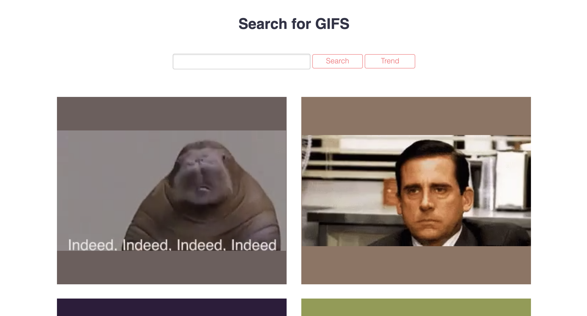

# Gif-Search website

This is a website built in Node js and Express and allows user to get GIFs through Tenor API



## How to run the project

After cloning this project, run the code below in your project terminal

```
$ npm install express --save
$ node app.js
```